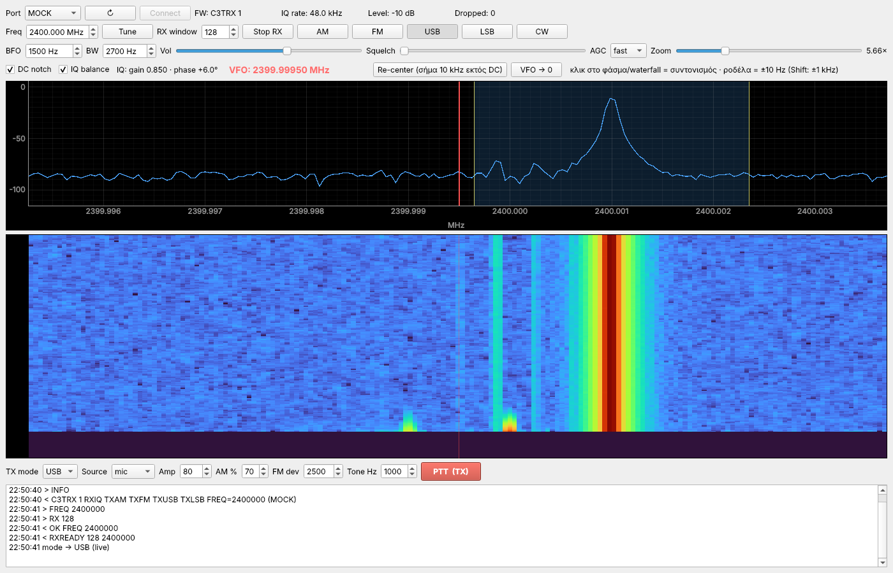
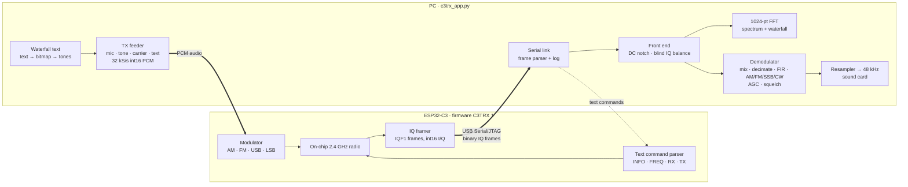
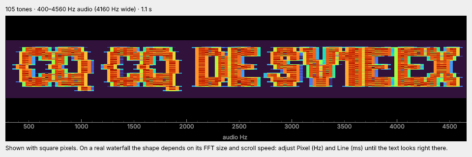
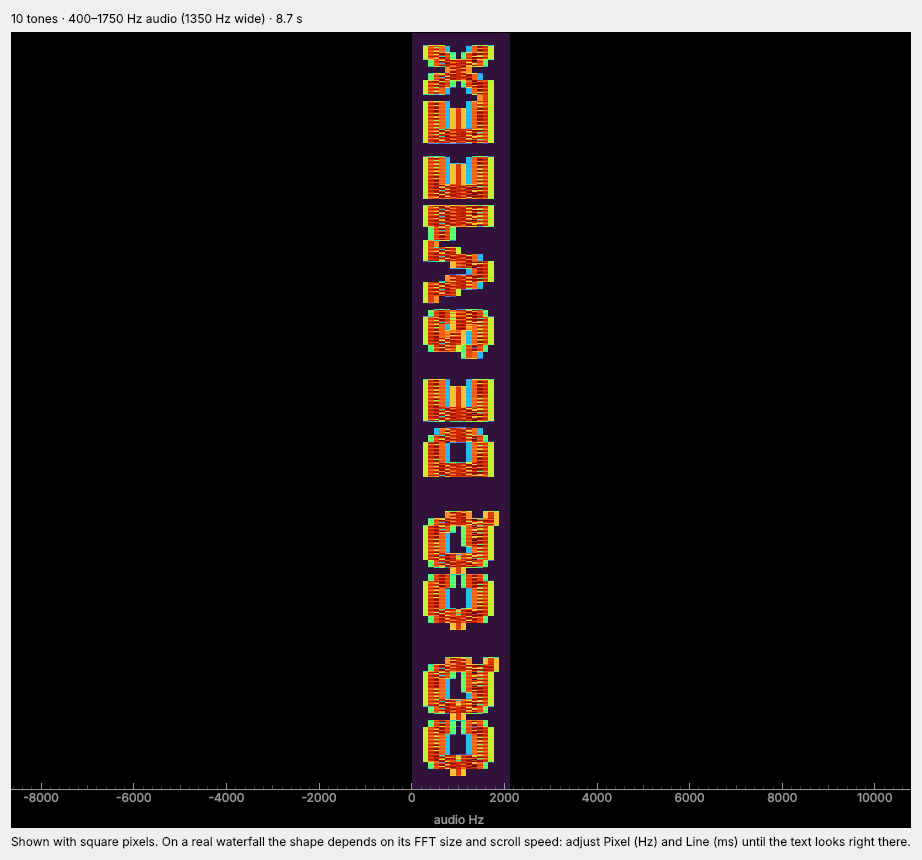
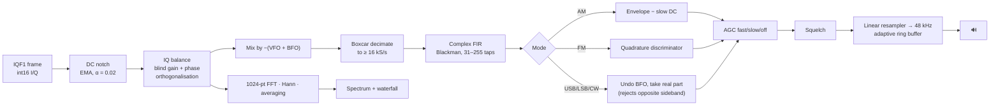

<div align="center">

# 📡 C3TRX · esp32c3rxtx

### A full 2.4 GHz SDR transceiver built on the ESP32‑C3's on‑chip radio

**Raw IQ over USB · software DSP on the desktop · AM / FM / USB / LSB / CW receive · AM / FM / USB / LSB transmit · text painted on the waterfall**




<sub>The C3TRX desktop app running in <code>--mock</code> mode (simulated +1 kHz carrier with deliberate DC offset and IQ imbalance — the IQ‑balance readout shows it being measured and corrected live).</sub>

</div>

---

## Table of contents

- [What this is](#what-this-is)
- [How it works](#how-it-works)
- [Feature tour](#feature-tour)
- [Waterfall text messages](#-waterfall-text-messages) 🆕
- [Project status](#project-status)
- [Repository layout](#repository-layout)
- [Quick start](#quick-start)
  - [1. Flash the firmware](#1-flash-the-firmware)
  - [2. Install and run the app](#2-install-and-run-the-app)
  - [3. First reception](#3-first-reception)
  - [4. Transmitting](#4-transmitting)
- [Using the app](#using-the-app)
- [The DSP chain in detail](#the-dsp-chain-in-detail)
- [Firmware protocol reference](#firmware-protocol-reference)
- [Verified behaviour (mock self‑test)](#verified-behaviour-mock-self-test)
- [Firmware image details](#firmware-image-details)
- [Troubleshooting](#troubleshooting)
- [Regulatory note](#regulatory-note)
- [Author](#author)

---

## What this is

The **ESP32‑C3** is a low‑cost RISC‑V microcontroller with a 2.4 GHz radio built into the silicon. Normally that radio only ever speaks Wi‑Fi and Bluetooth LE. **C3TRX turns it into a general‑purpose narrowband SDR transceiver** for the 2.4 GHz band:

- the **firmware (C3TRX 1)** tunes the on‑chip radio, captures **raw complex baseband IQ** and streams it to the PC over the chip's **native USB**, and on transmit accepts **PCM audio** from the PC and modulates it onto the carrier (AM, FM, USB, LSB);
- the **desktop app (`c3trx_app.py`)** does all the receive DSP — spectrum, waterfall, DC and IQ correction, channel filtering, demodulation, AGC, squelch, audio — and drives PTT with microphone, test‑tone, carrier or **waterfall‑text** sources.

No external RF hardware, no SDR dongle, no mixer, no codec: **one ESP32‑C3 board and a USB cable.**

> **Design philosophy:** keep the microcontroller dumb and fast (tune, stream, modulate) and put every piece of signal processing on the PC, where it is easy to inspect, change and improve. Any improvement to demodulation is a Python edit — no re‑flashing.

---

## How it works



The link is **half‑duplex**: while receiving, the firmware is busy streaming and does not parse commands, so the app stops RX (`Ctrl‑C`, byte `0x03`), sends the command, and restarts RX. Retuning, re‑centering and PTT all handle this automatically.

---

## Feature tour

### 📻 Receiver

| Feature | Details |
|---|---|
| **Modes** | AM, FM, USB, LSB, CW — switchable live while receiving |
| **Tuning** | Hardware centre frequency set in 1 kHz steps (app control 2300–2500 MHz; the firmware enforces its own limits) + a software **VFO** anywhere inside the received span |
| **Click‑to‑tune** | Click on the spectrum or waterfall to put the VFO on a signal |
| **Fine tuning** | Mouse wheel = ±10 Hz, **Shift** + wheel = ±1 kHz |
| **Re‑center** | One click retunes the radio so the selected signal sits **10 kHz away from DC**, clear of the LO leakage spur, while keeping the VFO on it |
| **DC notch** | Adaptive removal of the zero‑IF DC/LO spike (toggle) |
| **IQ balance** | Blind, continuous estimation and correction of I/Q amplitude and phase error — live readout of gain and phase (toggle) |
| **Channel filter** | Complex FIR, Blackman window, 31–255 taps sized automatically to the sample rate; bandwidth 200 Hz – 20 kHz |
| **BFO** | −50 kHz … +50 kHz passband offset (presets per mode) |
| **AGC** | fast / slow / off |
| **Squelch** | Channel‑level gate, threshold −100 … 0 dB |
| **Audio** | Resampled to 48 kHz, low‑latency output with automatic drift control |

**Per‑mode presets** (applied when you press a mode button, freely adjustable afterwards):

| Mode | Bandwidth | BFO |
|---|---:|---:|
| AM  | 6000 Hz  | 0 Hz |
| FM  | 12000 Hz | 0 Hz |
| USB | 2700 Hz  | +1500 Hz |
| LSB | 2700 Hz  | −1500 Hz |
| CW  | 500 Hz   | +700 Hz |

### 📊 Display

- **Spectrum**: 1024‑point FFT, Hann window, exponential averaging, absolute frequency axis in MHz, −110…0 dB.
- **Waterfall**: 300 lines, *turbo* colormap, frequency‑locked to the spectrum.
- **Overlays**: red VFO line on both views, shaded receive passband (follows mode, BFO and bandwidth).
- **Zoom**: centred on the VFO, up to 64× (down to 16 FFT bins), clamped at band edges.
- **Status bar**: firmware ID, live IQ sample rate, signal level, dropped‑sample counter, IQ‑balance readout.

### 📡 Transmitter

| Feature | Details |
|---|---|
| **Modes** | USB, LSB, AM, FM |
| **Sources** | **mic** (sound‑card input), **tone** (50–5000 Hz sine), **carrier**, **text** ([waterfall text](#-waterfall-text-messages)) |
| **Frequency** | Transmits on the **VFO** frequency (centre + VFO offset) — click a signal, press PTT |
| **Drive** | Amplitude 1–480 (firmware units) |
| **AM depth** | 1–95 % |
| **FM deviation** | 100–12000 Hz |
| **Audio path** | 32 kS/s, int16 little‑endian PCM streamed to the firmware |
| **Safety** | App refuses to transmit above 2450 MHz; a carrier test in SSB is automatically switched to AM (SSB with no audio radiates nothing) |
| **End of TX** | Firmware reports `TXEND` with sample and underrun counters |

### 🧪 Developer features

- **`--mock`**: runs the whole app with no hardware — a simulated C3TRX 1 producing a +1 kHz carrier with DC offset, 15 % amplitude and 6° phase IQ imbalance, so the DC notch and IQ balance can be seen working.
- **`--selftest N`**: automated end‑to‑end check (connect, RX, spectrum/image measurement, VFO zero‑beat, all five demodulators, retune while streaming) that prints a report and saves `selftest.png`.
- **Firmware check**: on connect the app reads `INFO` and warns if the board is not running C3TRX 1.
- **Protocol console**: every command sent (`>`) and every line received (`<`) is logged with a timestamp.
- **Mock TX**: the simulator accepts PCM after `TX` and answers `TXEND samples=… underruns=0` once the audio stops, like the firmware, so the whole PTT cycle can be tested without hardware.

---

## 🆕 Waterfall text messages

Write a message, press PTT, and it appears **as text on the waterfall** of every receiver that sees your signal — SDR++, SDR#, WSJT‑X, an RTL‑SDR on the bench, or another C3TRX.

<p align="center">
  
</p>
<p align="center"><sub>Preview of <code>CQ CQ DE SV1EEX</code>, horizontal layout, 40 Hz per pixel — exactly the audio the app sends.</sub></p>

### How it works

1. The text is drawn with a **Qt font** into a 1‑bit bitmap (any language your system fonts cover — Greek included).
2. The bitmap is sent **one pixel line per time slice**. In each slice, every lit pixel becomes a **sine tone** at `Base + k × Pixel` Hz.
3. The tones are summed and transmitted in **USB** (or LSB), so each audio tone lands on RF at *carrier + tone*: the receiver's waterfall draws the bitmap back.
4. Each tone is switched on and off with a **soft raised‑cosine edge** (up to 10 ms) to limit splatter. Every tone gets its own random phase so the peaks of the sum stay low, and the whole message is normalised to 90 % of full scale.

The app always picks the right orientation for you:

| Situation | What the app does |
|---|---|
| **TX mode = USB** | Tone *k* (low → high) = pixel *k*. |
| **TX mode = LSB** | Pixel order is mirrored, because LSB flips audio in RF — the text is **not** mirrored on air. |
| **TX mode = AM or FM** | Switched to **USB** automatically (AM would double and mirror the picture, FM would smear it). |
| **Receiver waterfall scrolls down** (newest line on top — most SDR apps) | Lines are sent bottom‑first so the text ends up upright. |
| **Receiver waterfall scrolls up** | Choose *newest at bottom*; the order is reversed. |

### Two layouts

| | **vertical (narrow)** — default | **horizontal (wide)** |
|---|---|---|
| Text runs along | time (down the waterfall), rotated 90° | frequency (across the waterfall), upright |
| Tones | font height (≈ 10 for 12 px) | text width (≈ 6–8 per character) |
| Bandwidth, defaults | ≈ 1.35 kHz — **fits an SSB channel** | several kHz — reduce **Pixel** to fit |
| Duration | long (one line per bitmap column) | short (one line per bitmap row) |
| Best for | CQ calls, callsigns, beacons | short words seen on wide‑band SDR waterfalls |

<p align="center">
  
</p>
<p align="center"><sub>Vertical layout: the same message fits in 1.35 kHz. On a top‑scrolling waterfall it reads from the bottom up (tilt your head left).</sub></p>

### Controls (row under the TX panel)

| Control | Range / default | Meaning |
|---|---|---|
| **WF text** | `CQ CQ DE SV1EEX` | The message |
| **Layout** | vertical (narrow) / horizontal (wide) | See above |
| **Height** | 6–40 px, **12 px** | Font size → number of pixel lines of the glyphs |
| **Pixel** | 20–1000 Hz, **150 Hz** | Frequency step between neighbouring pixels |
| **Line** | 10–1000 ms, **80 ms** | Duration of one pixel line (scroll‑direction size of a pixel) |
| **Base** | 100–10000 Hz, **400 Hz** | Audio frequency of the lowest pixel |
| **RX waterfall** | newest on top / newest at bottom | Scroll direction of the *receiving* waterfall |
| **Preview** | — | Spectrogram of the exact audio that will be sent, drawn with square pixels |
| **Save WAV** | — | Writes the message as 48 kHz / 16‑bit mono WAV — play it into **any SSB transceiver** (e.g. an FT‑817) |
| *info label* | — | Live tone count, audio range, duration; warns when wider than an SSB channel or above 15 kHz |

### Sending a message

1. Put the VFO where you want the message (click or wheel). The picture starts at **VFO + Base** in USB.
2. Set **Source = text**, type the message, pick the layout, press **Preview** to check it.
3. Press **PTT (TX)**. The app stops RX, sends `FREQ` and `TX USB <amp> 0`, and streams the message in real time.
4. When the message ends, the app stops sending audio, the firmware ends TX and reports `TXEND`, and the PTT button resets by itself. Press **Start RX** to listen again.

### Tuning the shape for a given receiver

A waterfall pixel is *(FFT bin width) × (time per line)*. For the text to look right:

- **Pixel (Hz)** should be at least **2 FFT bins** of the receiving waterfall. SDR++ / SDR# with a large FFT can resolve 20–50 Hz. The C3TRX app's own waterfall uses a 1024‑point FFT over the full IQ span, so its bins are about **rate / 1024 (≈ 140 Hz at 147 kS/s)** — use **Pixel ≥ 300 Hz** when the receiver is another C3TRX.
- **Line (ms)** sets the height of a pixel. If letters look squashed or stretched, change **Line**.
- **Narrower = more readable at weak signal**: total TX power is shared between all lit pixels, so fewer and larger pixels show up better.

### Verified

- **Bit‑exact round trip:** for both layouts, USB and LSB, and both scroll directions, the generated audio was decoded back into pixels by measuring every tone in every slice — **0 pixel errors out of 650**.
- **Full PTT cycle in `--mock`:** source *text* with TX mode AM → app switched to USB, sent `TX USB 80 0`, streamed all **51 840** samples with **0 underruns**, received `TXEND`, PTT reset.
- **On air:** not yet — depends on the firmware's TX path, which is still experimental (see [Project status](#project-status)).

---

## Project status

| Area | Status |
|---|---|
| Firmware C3TRX 1 boots, `INFO`, `FREQ` | ✅ working on hardware |
| RX IQ streaming, spectrum and waterfall | ✅ working on hardware |
| AM / USB demodulation | ✅ confirmed by ear on hardware |
| FM / LSB / CW demodulation | ✅ verified in the mock self‑test |
| TX (AM / FM / USB / LSB) | 🧪 experimental — not yet confirmed on air |
| Waterfall text (app side) | ✅ verified in software (pixel‑exact decode, mock PTT cycle); on air pending TX |
| Firmware source code | ⏳ not yet published — this repository currently ships the prebuilt image |

---

## Repository layout

```
esp32c3rxtx/
├── README.md               ← you are here
├── app/
│   ├── c3trx_app.py        ← desktop application (PySide6 + pyqtgraph)
│   └── requirements.txt
├── firmware/
│   ├── c3trx1_merged.bin   ← C3TRX 1, merged image (bootloader + partitions + app), flash at 0x0
│   └── SHA256SUMS
└── docs/
    ├── screenshot.png
    ├── wftext_horizontal.png
    └── wftext_vertical.png
```

The firmware binary is also attached to the **[v1 release](../../releases)**.

---

## Quick start

### What you need

- Any **ESP32‑C3** board with the chip's **native USB** port (USB Serial/JTAG) and **4 MB flash** — e.g. ESP32‑C3 SuperMini or Seeed XIAO ESP32C3. Boards that only expose a USB‑UART bridge chip are not supported by this build. Chip revision v0.3 or later.
- A PC with **Python 3.9+** (Windows, Linux or macOS).
- Optional: a 2.4 GHz antenna if your board has an antenna connector; the PCB antenna works for nearby signals.

### 1. Flash the firmware

The image is a **merged** binary — one file, written at address **`0x0`**.

**Windows (PowerShell):**

```powershell
py -m pip install esptool
py -m esptool --chip esp32c3 --port COM3 --baud 921600 write-flash 0x0 firmware\c3trx1_merged.bin
```

**Linux / macOS:**

```bash
python3 -m pip install esptool
python3 -m esptool --chip esp32c3 --port /dev/ttyACM0 --baud 921600 write-flash 0x0 firmware/c3trx1_merged.bin
```

> esptool older than v5 uses `write_flash` (underscore) instead of `write-flash`.
> If the port does not appear, hold **BOOT**, tap **RESET**, release **BOOT**, then flash.

Check the download:

```bash
sha256sum firmware/c3trx1_merged.bin
# 263418f244f25a26546aa6b94b579867344a7d7c289280b91856ccc1ff2dd2a8
```

### 2. Install and run the app

```powershell
cd app
py -m pip install -r requirements.txt      # pyside6 pyqtgraph numpy pyserial sounddevice
py c3trx_app.py
```

No board yet? Try everything with the simulator:

```powershell
py c3trx_app.py --mock
```

### 3. First reception

1. Pick the board's port and press **Connect** → the status bar shows `FW: C3TRX 1`.
2. Set **Freq** (e.g. `2400.000 MHz`) and press **Start RX**.
3. Look at the spectrum/waterfall, **click on a signal** to put the VFO on it.
4. Choose the mode (**AM / FM / USB / LSB / CW**) and adjust **BW**, **Vol**, **AGC**, **Squelch**.
5. If the signal is near the centre spike, press **Re‑center** to move it 10 kHz away from DC.

### 4. Transmitting

1. Put the VFO where you want to transmit (click or wheel).
2. Choose **TX mode**, **Source** (`mic`, `tone`, `carrier`, `text`), **Amp**, and **AM %** or **FM dev**.
3. Press **PTT (TX)** — RX stops, the radio is tuned to the VFO frequency and audio starts streaming.
4. Press **STOP TX** to end; the firmware reports `TXEND`. Press **Start RX** to listen again.

With **Source = text** the transmission ends by itself when the message is complete — see [Waterfall text messages](#-waterfall-text-messages).

---

## Using the app

```
┌ Port [COM3 ▾] [↻] [Connect]   FW: C3TRX 1   IQ rate   Level   Dropped ─────────────┐
├ Freq [2400.000 MHz] [Tune]  RX window [128]  [Start RX]  AM FM USB LSB CW          ┤
├ BFO  BW  Vol  Squelch  AGC  Zoom                                                    ┤
├ ☑ DC notch  ☑ IQ balance  IQ: gain · phase   VFO: 2400.00000 MHz  [Re-center] [VFO→0]┤
├──────────────────────────── spectrum (click = tune) ────────────────────────────────┤
├──────────────────────────── waterfall (click = tune) ───────────────────────────────┤
├ TX mode  Source  Amp  AM %  FM dev  Tone Hz   [ PTT (TX) ]                          ┤
├ WF text  Layout  Height  Pixel  Line  Base  RX waterfall  [Preview] [Save WAV]  info ┤
└ log: > commands sent   < firmware replies ───────────────────────────────────────────┘
```

| Control | What it does |
|---|---|
| **Freq / Tune** | Hardware centre frequency. *Tune* applies it (stops and restarts RX if needed). |
| **RX window** | Samples per IQ frame requested from the firmware (firmware accepts 32–4096). Smaller = lower latency, larger = less USB overhead. |
| **VFO** | Software receive/transmit frequency inside the captured span (shown in red). |
| **VFO → 0** | Puts the VFO back on the hardware centre. |
| **Re‑center** | Retunes so the current VFO signal sits 10 kHz off DC. |
| **BFO** | Offset of the passband centre relative to the VFO (SSB/CW). |
| **BW** | Channel filter bandwidth. |
| **Zoom** | Spectrum/waterfall zoom around the VFO. |
| **DC notch / IQ balance** | Front‑end corrections; the label shows the measured Q/I gain and phase error. |
| **WF text row** | Message, layout and pixel geometry for **Source = text** — see [Waterfall text messages](#-waterfall-text-messages). |

---

## The DSP chain in detail



**Front end.** The ESP32‑C3 receiver is a zero‑IF design, so every capture carries a DC/LO spike and some I/Q imbalance, which shows up as a mirror image of every signal. The app removes DC with a running average and then estimates, block by block, the Q/I power ratio and the I·Q correlation. From these it computes the gain error *g* and the phase error *φ*, and rebuilds an orthogonal Q′ = (Q/g − I·sin φ)/cos φ. The spectrum and the demodulator both use the corrected samples.

**Channel selection.** The VFO+BFO shift brings the wanted passband to 0 Hz. Boxcar averaging then decimates by D = ⌊rate / 16000⌋ (the remainder is carried over between frames), and a stateful complex FIR low‑pass applies the selected bandwidth. The tap count scales with the decimated rate and is recomputed only when rate, decimation or bandwidth change.

**Demodulators.**
- **AM**: magnitude of the filtered signal with a very slow DC tracker removed, so the audio has no carrier offset.
- **FM**: phase difference between consecutive samples, normalised to ±1.
- **SSB / CW**: the filter is centred at +BFO (USB/CW) or −BFO (LSB). Shifting back by the BFO and taking the real part gives audio relative to the VFO and suppresses the other sideband.

**AGC and audio.** A peak‑following envelope (fast attack; fast or slow release) sets the gain, then squelch gates on the channel level. A fractional‑phase linear resampler converts the demod rate to 48 kHz and feeds a low‑latency output stream. If the buffer grows beyond 400 ms because of clock drift, it is trimmed back to 100 ms.

---

## Firmware protocol reference

The firmware talks over the ESP32‑C3's **native USB Serial/JTAG** port, so the baud rate setting has no effect (the app opens it at 921600). Commands are ASCII lines ending in `\n`. Frequencies are in **kHz**.

### Commands

| Command | Reply | Notes |
|---|---|---|
| *(boot)* | `C3TRX READY` | |
| `INFO` | `C3TRX 1 RXIQ TXAM TXFM TXUSB TXLSB FREQ=<kHz>` | Firmware ID + capabilities + current frequency |
| `FREQ <kHz>` | `OK FREQ <kHz>` | Errors: `ERR FREQ <min>..<max> kHz`, `ERR TUNE` |
| `RX <window>` | `RXREADY <window> <kHz>`, then binary IQ frames | `window` = 32…4096 samples per frame (`ERR RX window 32..4096`) |
| byte `0x03` | `RXEND` | Stops RX streaming |
| `TX <AM\|FM\|USB\|LSB> <amp> <param>` | `TXREADY <mode> <kHz> <audio rate>` | `amp` 1…480; `param` = AM depth 1…95 %, FM deviation 100…12000 Hz, or 0 for SSB |
| *(PCM stream)* | — | int16 little‑endian mono at the announced rate (32 kS/s) |
| *(TX ends)* | `TXEND samples=<n> underruns=<n>` · `TXEND NOAUDIO` · `TXEND TUNE` | End of transmission |
| anything else | `ERR ? commands: INFO, FREQ <kHz>, RX <window>, TX <AM\|FM\|USB\|LSB> <amp> <depth\|deviation\|0>` | |

Other errors: `ERR MODE AM|FM|USB|LSB`, `ERR AMP 1..480`, `ERR AM depth 1..95`, `ERR FM deviation 100..12000 Hz`, `ERR TX frequency <kHz> outside <min>..<max> kHz`.

### IQ frame format (`IQF1`)

All fields little‑endian:

| Offset | Size | Field |
|---:|---:|---|
| 0 | 4 | Magic `"IQF1"` |
| 4 | 2 | `count` — complex samples in this frame |
| 6 | 2 | `flags` |
| 8 | 4 | `rate` — sample rate in Hz |
| 12 | 4 × count | `count` pairs of `int16 I, int16 Q` |

The app resynchronises on the magic, checks `count` (1…4096), takes the sample rate from the header, counts any skipped bytes as *Dropped*, and passes interleaved text lines to the log.

Minimal reader:

```python
import serial, struct, numpy as np
s = serial.Serial("COM3", 921600, timeout=0.1)
s.write(b"FREQ 2400000\n"); s.write(b"RX 128\n")
buf = b""
while True:
    buf += s.read(4096)
    i = buf.find(b"IQF1")
    if i < 0 or len(buf) < i + 12: continue
    cnt, flags, rate = struct.unpack_from("<HHI", buf, i + 4)
    end = i + 12 + 4 * cnt
    if len(buf) < end: continue
    iq = np.frombuffer(buf[i + 12:end], "<i2").astype(np.float32) / 32768
    z = iq[0::2] + 1j * iq[1::2]          # complex baseband, `rate` samples/s
    buf = buf[end:]
```

---

## Verified behaviour (mock self‑test)

`py c3trx_app.py --mock --selftest 4` runs the full pipeline against the simulator, which injects a +1 kHz carrier with a DC offset, a **15 % amplitude** error and a **6° phase** error. Output from the published app (abridged):

```
FW FW: C3TRX 1 | IQ rate: 48.0 kHz | Level: -10 dB | dropped 0 | IQ: gain 0.850 · phase +6.0°
spectrum: signal +1k -11.1 dB | image -1k -88.8 dB | DC -86.0 dB
USB VFO +0 Hz:    rms  -5.9 dB  ~tone 1122 Hz
USB VFO +1000 Hz: rms -43.7 dB  (carrier zero-beat)
USB VFO +300 Hz:  rms  -5.9 dB  ~tone  722 Hz
USB: rms  -5.9 dB  ~tone 1121 Hz
LSB: rms -52.3 dB                (opposite sideband rejected)
CW:  rms -19.9 dB  ~tone  999 Hz
AM:  rms -14.0 dB
FM:  rms -10.1 dB
after re-center: freq 2399.9910 | VFO: 2400.00100 MHz | rx True
```

What this shows:

- **IQ correction:** the estimator recovers the injected errors (gain 0.850, phase +6.0°), and the image falls to **~78 dB below** the signal. The DC spike is notched to the noise floor.
- **Sideband rejection:** the same carrier is **~46 dB** weaker in LSB than in USB.
- **VFO:** tuning onto the carrier gives zero beat, and offsets shift the audio tone as expected.
- **Retune while streaming:** stop → `FREQ` → `RX` restarts cleanly with the signal moved 10 kHz off DC.

---

## Firmware image details

Read from `firmware/c3trx1_merged.bin` with `esptool image-info`:

| Property | Value |
|---|---|
| Project / version | `esp32c3_trx` / `1` |
| Build date | Oct 7 2026, 17:10:36 |
| Framework | ESP‑IDF (commit `25fe69f9`) |
| Target | ESP32‑C3, chip revision v0.3 – v1.99 |
| Flash | 4 MB, DIO, 80 MHz |
| Layout | bootloader @ `0x0` · partition table @ `0x8000` · `nvs` @ `0x9000` (24 KB) · `phy_init` @ `0xF000` (4 KB) · `factory` app @ `0x10000` (1 MB) |
| Size | 686 976 bytes |
| SHA‑256 | `263418f244f25a26546aa6b94b579867344a7d7c289280b91856ccc1ff2dd2a8` |

---

## Troubleshooting

| Symptom | Fix |
|---|---|
| Log shows `!!! Wrong firmware on the device…` / FW is not `C3TRX 1` | The board runs a different build. Flash `c3trx1_merged.bin` at `0x0`. |
| No COM port | Use a data‑capable USB cable; press **↻**; enter download mode with BOOT + RESET for flashing. |
| `! sounddevice not installed: no audio` | `py -m pip install sounddevice` |
| *Dropped* counter keeps rising | Increase **RX window** (e.g. 256–512), close other heavy USB/CPU loads. |
| Strong spike in the centre | Normal zero‑IF LO leakage — keep **DC notch** on and use **Re‑center**. |
| Mirror images of signals | Keep **IQ balance** on; give it a second to converge (watch the gain/phase readout settle). |
| `! TX limited to 2300–2450 MHz by firmware` | Move the VFO/centre below 2450 MHz. |
| `TXEND NOAUDIO` | The firmware received no audio after `TX` — check the microphone device, or test with the `tone` source. |
| Firmware reboots on PTT (`Guru Meditation … Interrupt wdt timeout`) | TX is experimental; please open an issue with the full log. |

---

## Regulatory note

The 2.4 GHz range overlaps the 2400–2483.5 MHz ISM band and the 13 cm amateur allocation. **Transmitting is your responsibility.** Use the lowest drive that works, stay within your licence privileges and local rules, and do not interfere with Wi‑Fi, Bluetooth or other services.

---

## Author

**Nik Kontopoulos — SV1EEX** · [@z1000biker](https://github.com/z1000biker) · KM17tw, Attica, Greece

Issues, measurements, on‑air reports and pull requests are welcome. If you try C3TRX on your own board, please open an issue with the board model and your results.

<div align="center">

**73 de SV1EEX** 📡

</div>
